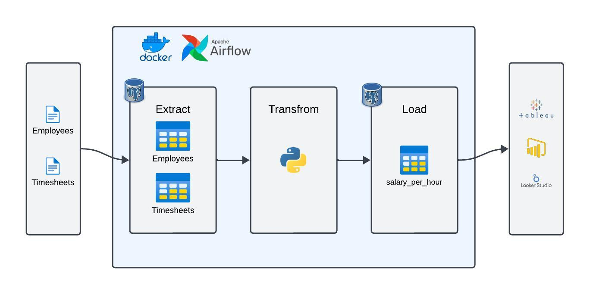
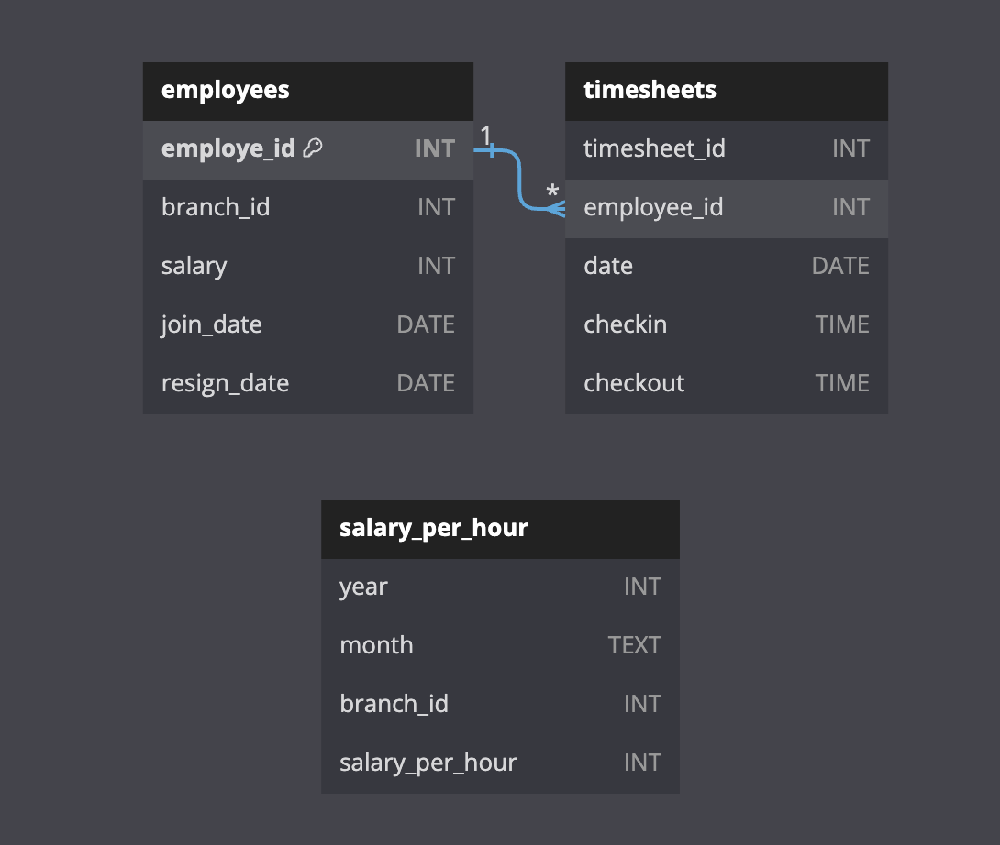

# Airflow Data Pipeline

## Data Pipeline

This project aims to analyze the cost-effectiveness of the current payroll scheme on a per-hour basis for each branch, utilizing Apache Airflow and Docker. It involves an ETL is a process that consists of Extract, Transform, and Load. ETL is the process of retrieving data from one or many sources. The data will be cleaned before being stored on new storage ready for analysis and Business Intelligence (BI) tools.

## Data Source

| File           | Description                  |
| -------------- | ---------------------------- |
| employees.csv  | contain order information    |
| timesheets.csv | contain Customer information |

## Schema

## Project Structure

This project is a setup for an Airflow environment with the following:

- **./data/**
  - `employees.csv`: All-time employee information (CSV)
  - `timesheets.csv`: Daily clock-ins and clock-outs of the employees (CSV)
- **./config/**
  - Configuration files (if any)
- **./dag/**
  - `dag.py`: Airflow Directed Acyclic Graph (DAG) definition
  - `db.py`: Database schema creation and loading scripts
  - `extract.py`: Scripts for extracting data from CSV files
  - `transform.py`: Scripts for transforming data
  - `load.py`: Scripts for loading data into destination tables
- **./logs/**
  - Log files generated during execution
- **.env**
  - Environment variables configuration
- **docker-compose.yaml**
  - Docker Compose configuration file
- **Dockerfile**
  - Dockerfile for building the Airflow container
- **requirements.txt**
  - Python dependencies list
